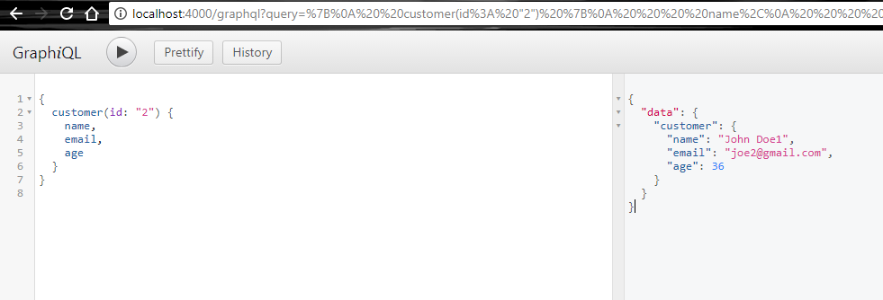
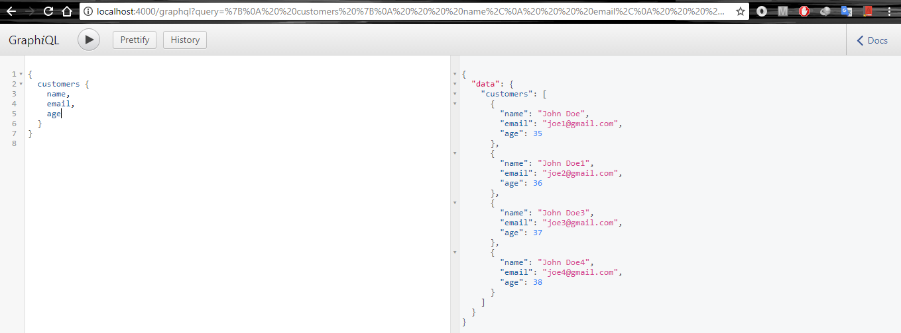
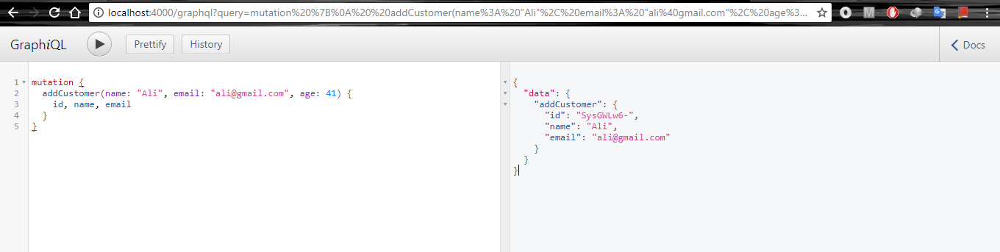

# GraphQL Server
Build only for server side for REST API using ExpressJS

# Usage
```
npm install
npm run dev:server
npm run json:server
```
Open in browser: [http://localhost:4000/graphql](http://localhost:4000/graphql) to test out with GraphiQL

# Screenshot



